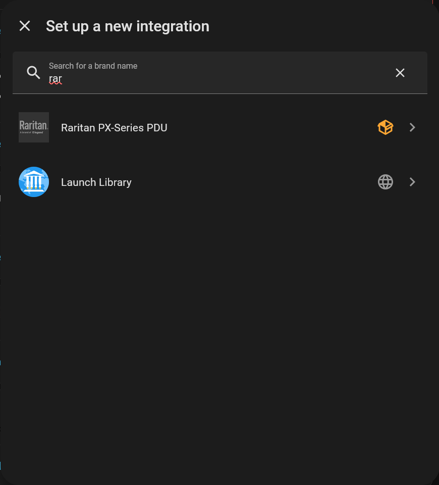
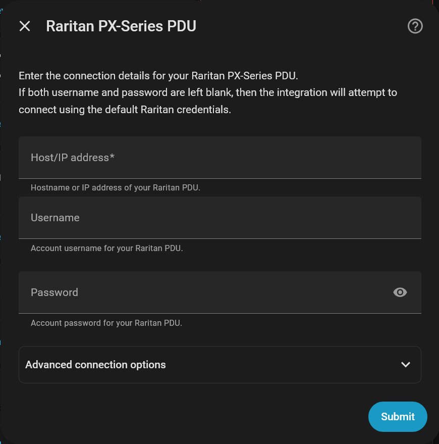
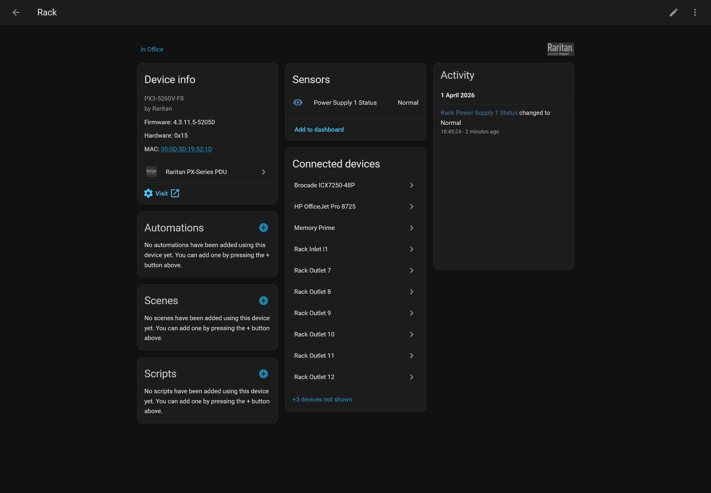
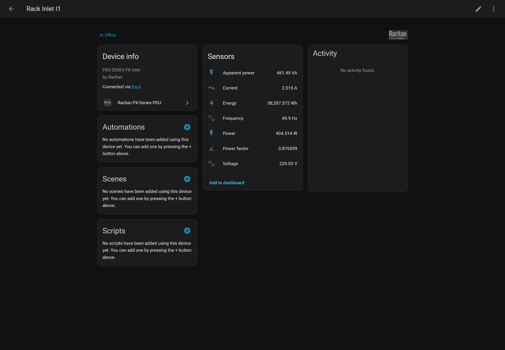
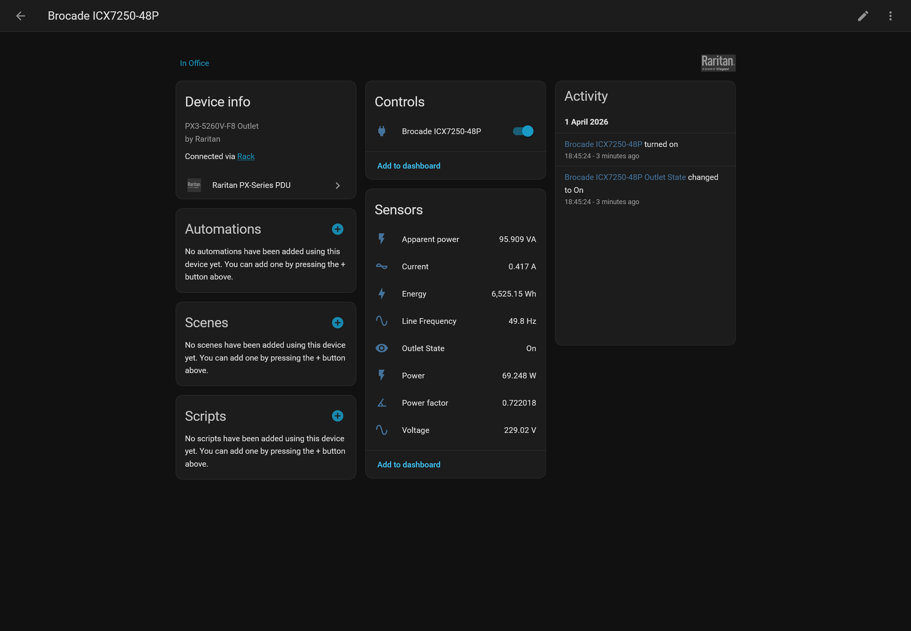

# Home Assistant Raritan PX-Series PDU Integration

A custom integration to expose and control your Raritan PX-Series PDUs within Home Assistant, using the built-in local [Xerus™ JSON-RPC API](https://help.raritan.com/json-rpc/4.3.13/index.html) - no Internet access required

This is an **unofficial** integration that is in **no way affiliated, endorsed or supported** by Raritan or Legrand

## Features

* PDU energy usage
* Outlet enegy usage *(PDU support required)*
* Outlet switching *(PDU support required)*

## Installation

The simplest way to install is via [HACS](https://github.com/hacs/integration)

### HACS

1. [Add the repository](https://my.home-assistant.io/redirect/hacs_repository/?owner=exterrestris&repository=home-assistant-raritan-px&category=integration) to your HACS installation
2. Click `Download`
3. Restart Home Assistant

### Manual Install

1. Download the latest [published release](https://github.com/exterrestris/home-assistant-raritan-px/releases)
2. Place the contents of `custom_components` into the `<config directory>/custom_components` folder of your Home Assistant installation
3. Restart Home Assistant

## Setup

1. Go to [Settings > Devices & services](https://my.home-assistant.io/redirect/integrations/)

2. Click [Add integration](https://my.home-assistant.io/redirect/config_flow_start/?domain=raritan_px)

3. Search for and select "Raritan PX-Series PDU":

   

4. Enter the connection details for your Raritan PDU:

   

5. Your PDU will then be visible in Home Assistant!

> [!TIP]
> By default, the integration will try to connect to your Raritan PDU over HTTPS unless configured otherwise. If your PDU has a self-signed certificate be sure to disable certificate verification in the Advanced connection options.
>
> Installing a verifiable certificate on your PDU is recommended, and can be done via the PDUs Web UI

## Supported Devices

Any PX-Series (PX2/PX3/PX4/PXO/PXC) PDU running Xerus 4.3.11 or greater

> [!NOTE]
> Whilst any PX-Series PDU running Xerus 4.3.0 or greater _should_ work without problems, I can only test with the PDUs I own.
>
> PDUs running Xerus 4.0.10 or greater _may_ work, but I have not checked the API changelog for breaking changes. Versions of Xerus prior to 4.0.10 are highly unlikely to work correctly

### Known working Devices
- [Raritan PX3-5260V-F8](https://www.raritan.com/product-selector/pdu-detail/px3-5260v-f8)

## FAQs

#### I can't see the energy usage for my PDU
Raritan PDUs report their energy usage by inlet, not for the PDU as a whole. For PDUs with one inlet, the total power usage for the PDU will be that of the inlet device

#### I can't see the energy usage by outlet
Outlet monitoring support is PDU specific. If your PDU supports outlet monitoring, then the relevant sensors will be exposed automatically

#### I can't turn my outlets on/off
Outlet switching support is PDU specific. If your PDU supports outlet switching, the switches for the outlets will be exposed automatically

## Screenshots

### PDU

### Inlet

### Outlet

